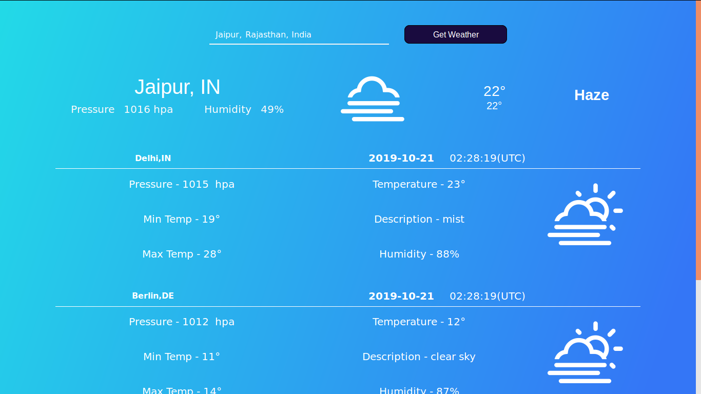
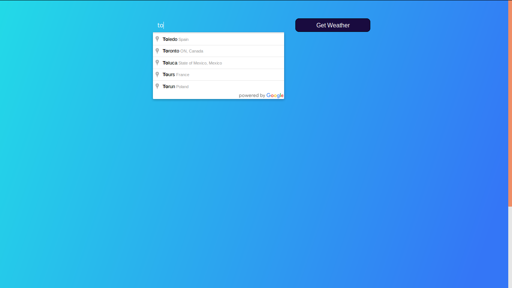
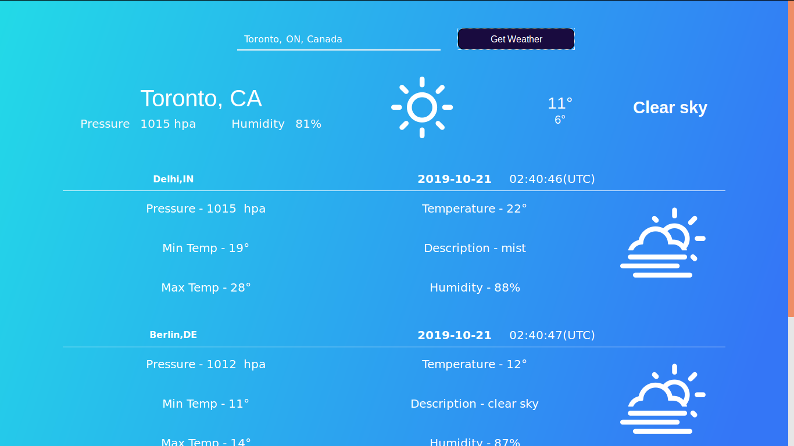
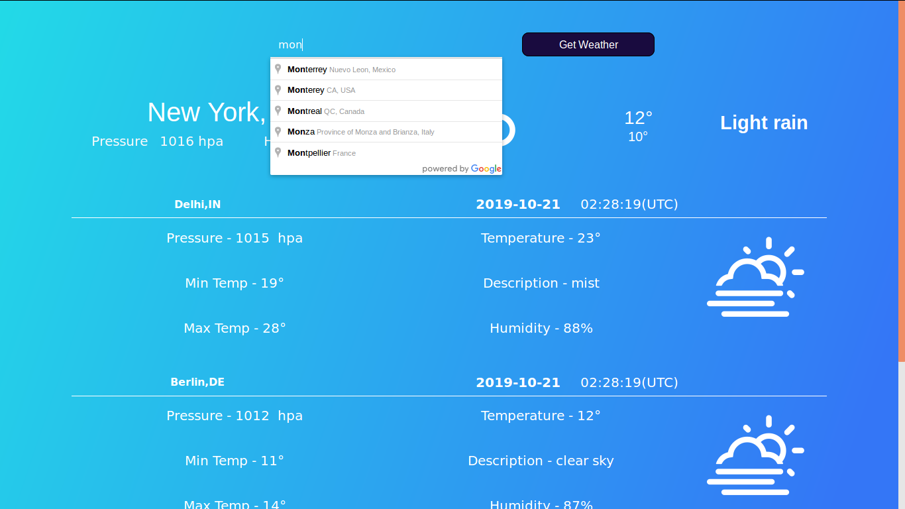
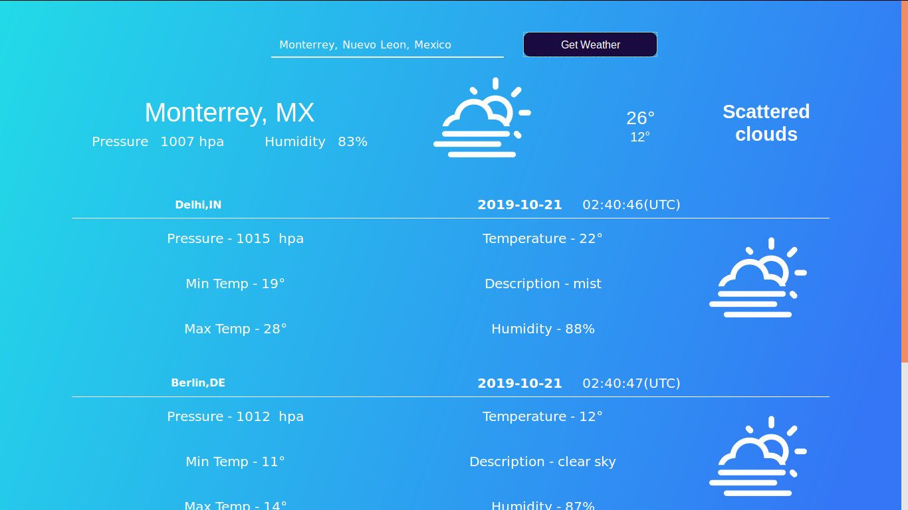

# Weather-App

## Requirements
#### 1. Install nodejs from <a href="https://nodejs.org/en/">Here</a>
#### 2. npm 

## How to Run
#### 1. Download and extract the project
#### 2. Go to project directory 
#### 3. then run command npm start

## Some Screenshot of project's working

